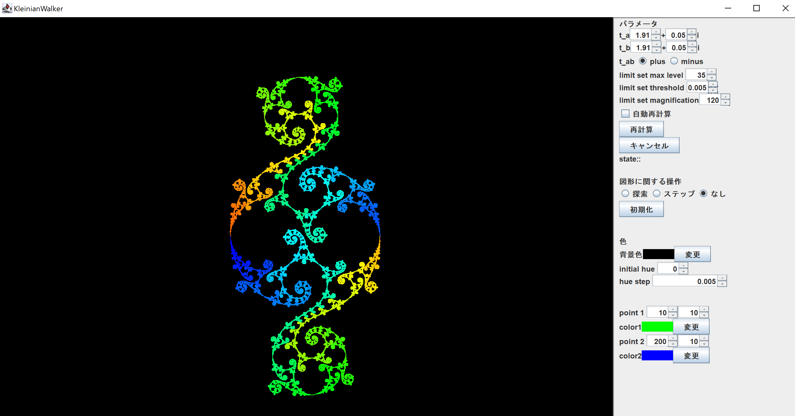

# KleinianWalker
The software drawing limit sets of Kleinian group and orbit of a figure.
This software is based on [https://github.com/soma-arc/IndraJava](https://github.com/soma-arc/IndraJava)

The development was stopped. However, some piece of code may help you.

## Usage
This is Eclipse project. So, you can import this project into Eclips
